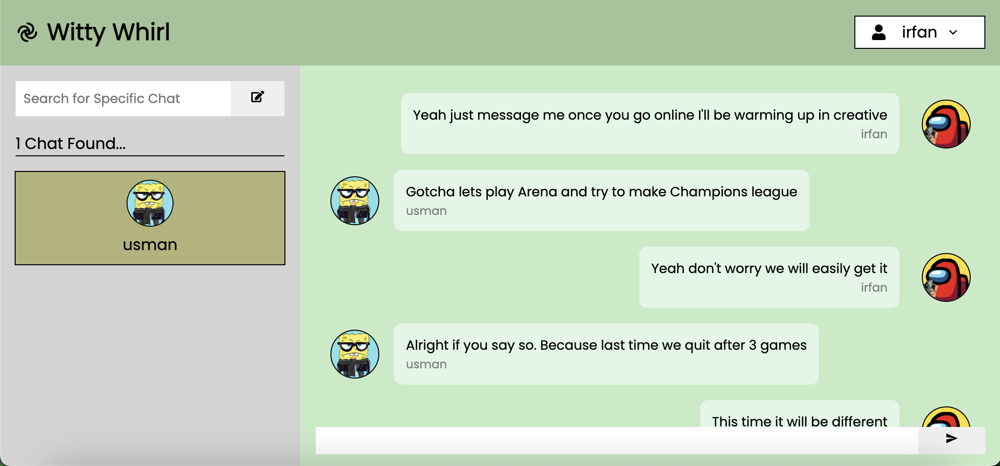
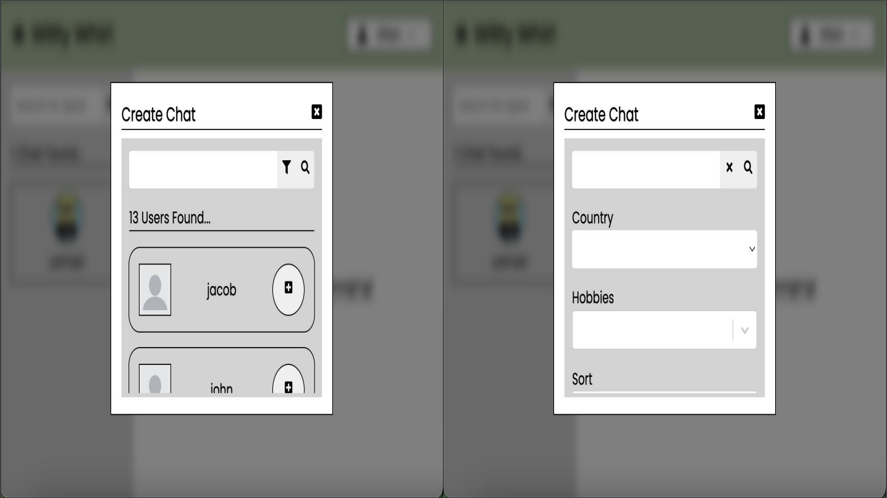
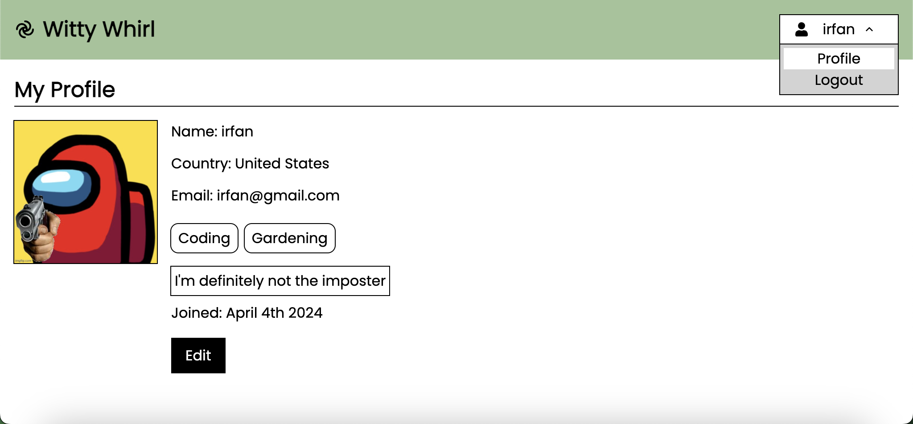

# Witty Whirl (PERN)

Witty Whirl is an amazing, real-time chat application designed to connect people based on their hobbies. Whether you’re looking for like-minded friends, want to discuss your favorite topics, or simply chat with others, Witty Whirl is the perfect platform. With its fast performance and visually appealing design, its easy to dive into meaningful discussions and build new connections!

## Screenshots 

## Technologies Used

- [TypeScript](https://www.typescriptlang.org/): A powerful and flexible superset of JavaScript, bringing static typing to your projects.
- [Sequelize](https://sequelize.org/): A powerful and flexible Node.js ORM for SQL databases.
- [Express](https://expressjs.com/): Fast, unopinionated, minimalist web framework for Node.js.
- [React](https://reactjs.org/): A JavaScript library for building user interfaces.
- [Node.js](https://nodejs.org/): JavaScript runtime built on Chrome's V8 JavaScript engine.
- [Web Sockets](https://websocket.org/): A communication protocol that enables real-time, bidirectional communication between the client and server. It allows data to be sent and received in real time, making it perfect for applications like real-time chat.
- [PostgreSQL](https://postgresql.org/): A powerful, open-source relational database system known for its stability, extensibility, and strong feature set.

## Setup Instructions

1st - Download the project

2nd - Run the following command "npm install" (install dependencies)

3rd - Now create a .env file in the root of your entire project with the following key value pairs: POSTGRESQL_USER, POSTGRESQL_USER_PASSWORD, JWT_SECRET, JWT_LIFETIME, CLOUD_NAME, CLOUD_API_KEY, and CLOUD_API_SECRET

Note: The cloud values must be from Cloudinary, which is where we host our images.

4th - Open up your PostgresSQL server and create a database called "witty_whirl". So just copy paste this code in and execute it

CREATE DATABASE witty_whirl;

5th - Type the following command "npm run start" to start application

DONE
